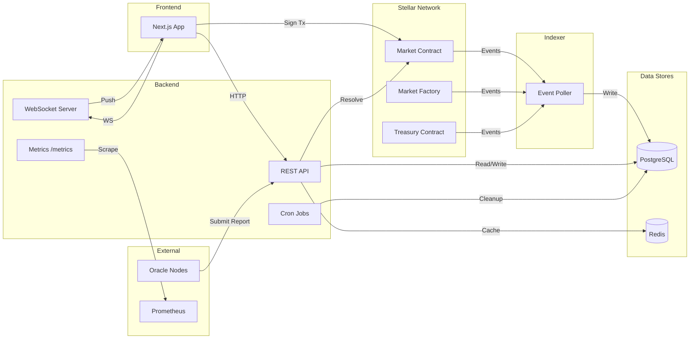
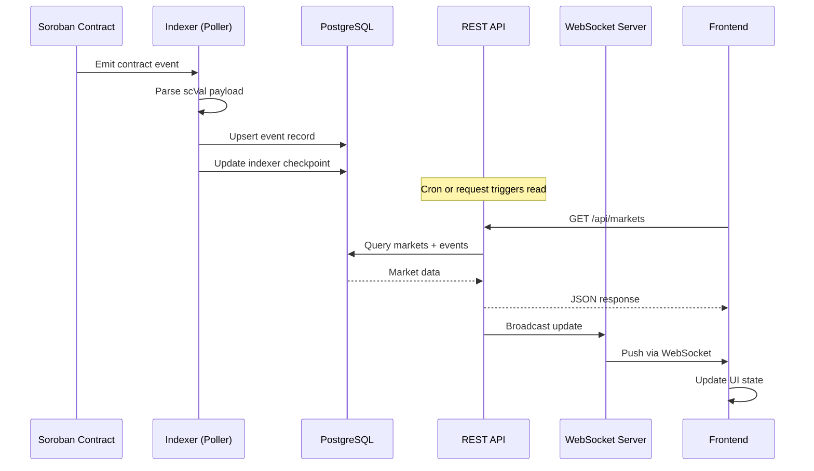
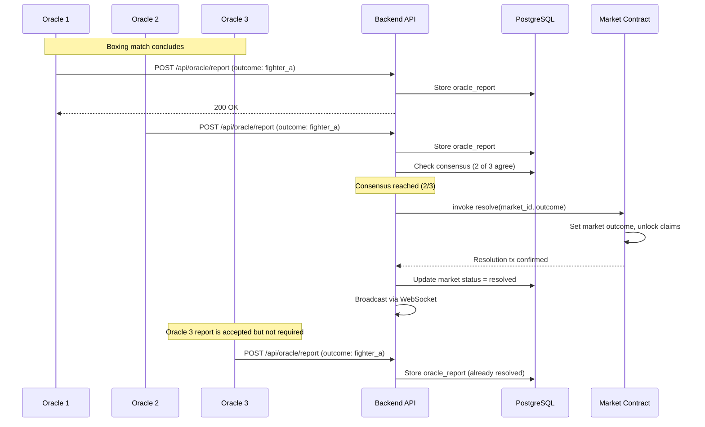
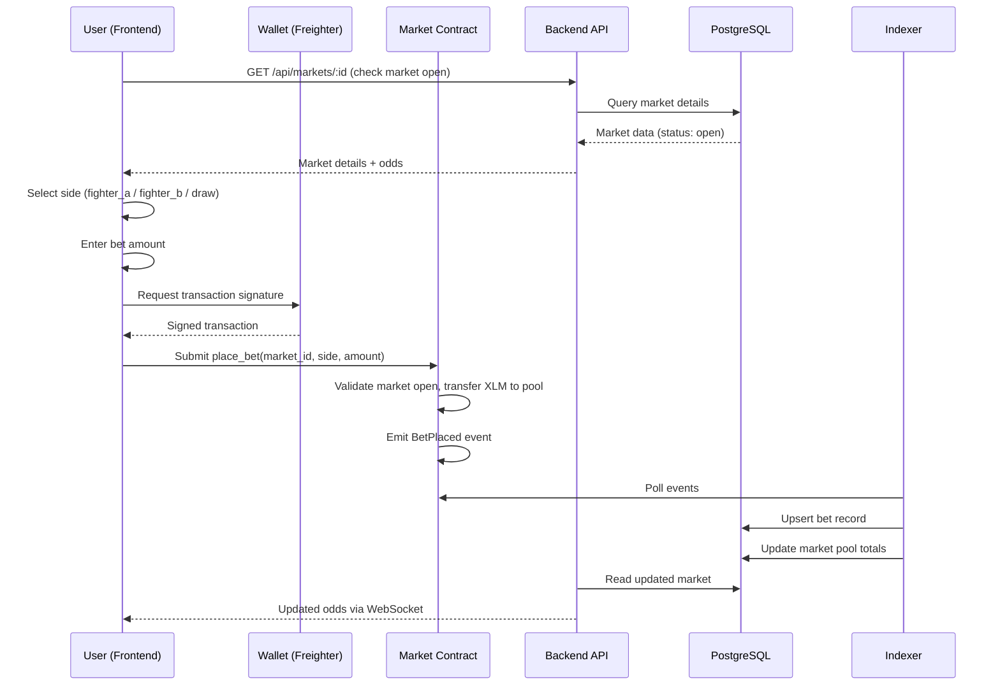
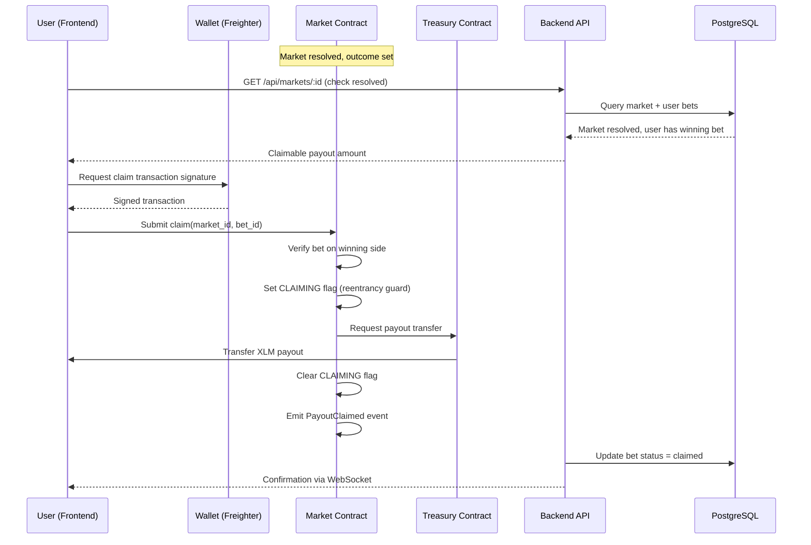

# BoxMeOut — Architecture Documentation

This document describes the high-level system architecture, data flows, and key interaction patterns of the BoxMeOut decentralized boxing prediction market.

## Table of Contents

- [System Overview](#system-overview)
- [System Diagram](#system-diagram)
- [Component Breakdown](#component-breakdown)
- [Data Flow: Contract Event to Frontend](#data-flow-contract-event-to-frontend)
- [Oracle Resolution Flow](#oracle-resolution-flow)
- [Bet Placement Flow](#bet-placement-flow)
- [Claim Payout Flow](#claim-payout-flow)

## System Overview

BoxMeOut is a full-stack decentralized application consisting of four main layers:

| Layer | Technology | Purpose |
|-------|-----------|---------|
| **Smart Contracts** | Rust / Soroban SDK | On-chain market logic, treasury, factory |
| **Indexer** | TypeScript | Polls Soroban events, persists to database |
| **Backend API** | Express / TypeScript | REST API, auth, caching, WebSocket feed |
| **Frontend** | Next.js 14 / React | User interface, wallet integration |

Supporting services include PostgreSQL (primary data store), Redis (caching and rate limiting), and Prometheus (metrics).

## System Diagram

## Component Breakdown

### Smart Contracts (Soroban)

| Contract | Responsibility |
|----------|---------------|
| **shared** | Common types, error codes, AMM math, event helpers |
| **market_factory** | Creates markets, manages oracle whitelist, emergency pause |
| **market** | Individual market logic — bet placement, claims, refunds |
| **treasury** | Fund custody, withdrawal limits, payout distribution |

**Security features:** Reentrancy guards (CLAIMING flag), emergency pause, oracle whitelist enforcement, 2-of-3 oracle consensus.

### Indexer

The indexer runs as a standalone TypeScript process that:

1. Polls the Soroban RPC endpoint every 5 seconds via `getEvents()`.
2. Filters events by contract ID and topic.
3. Parses `scVal` event payloads.
4. Upserts event data into PostgreSQL.
5. Maintains a cursor (`indexer_checkpoints` table) for crash recovery.

### Backend API

Express.js application providing:

- **REST API** — Markets, bets, claims, admin, auth, oracle endpoints.
- **Authentication** — JWT with session version tracking, 2FA/TOTP support.
- **Rate Limiting** — Redis-backed, per-route IP and user-based limits.
- **Caching** — Redis with 30-second TTLs and pattern-based invalidation.
- **WebSocket** — Real-time activity feed for live market updates.
- **Cron Jobs** — Auto-resolution, auto-lock, session/token cleanup.
- **Metrics** — Prometheus counters and histograms on `/metrics`.

### Frontend

Next.js 14 App Router application with:

- **State management** — Zustand stores.
- **Data fetching** — TanStack React Query.
- **Wallet integration** — Stellar SDK for transaction signing.
- **Styling** — Tailwind CSS.

## Data Flow: Contract Event to Frontend

This diagram shows how an on-chain event propagates through the system to the end user.

## Oracle Resolution Flow

Oracles are whitelisted accounts that submit match outcome reports. Resolution requires 2-of-3 consensus.

## Bet Placement Flow

## Claim Payout Flow

